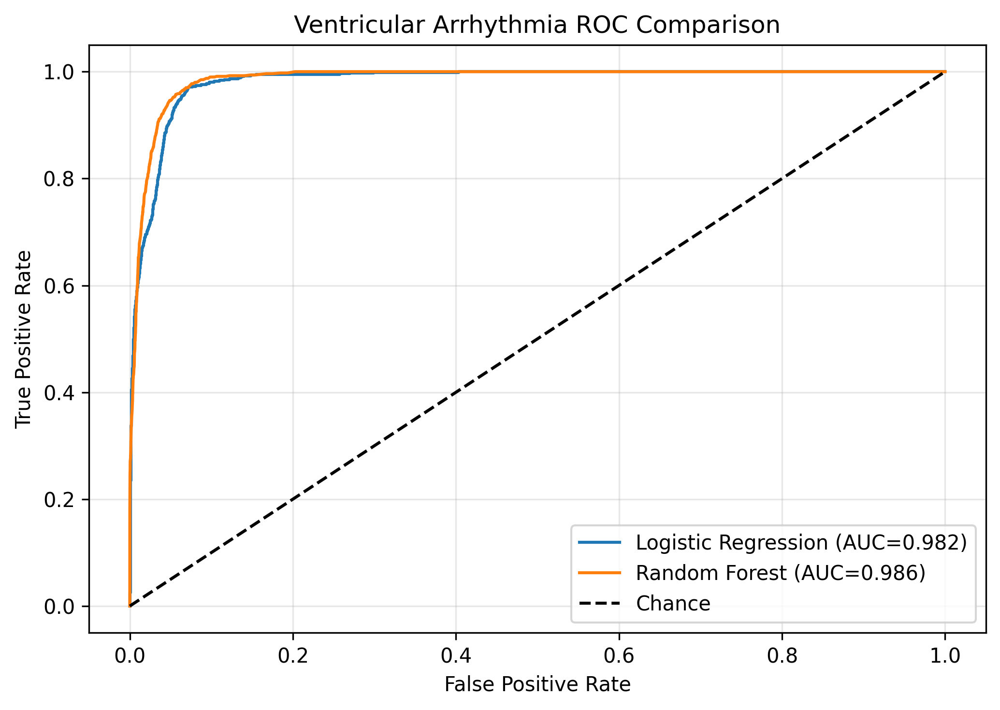
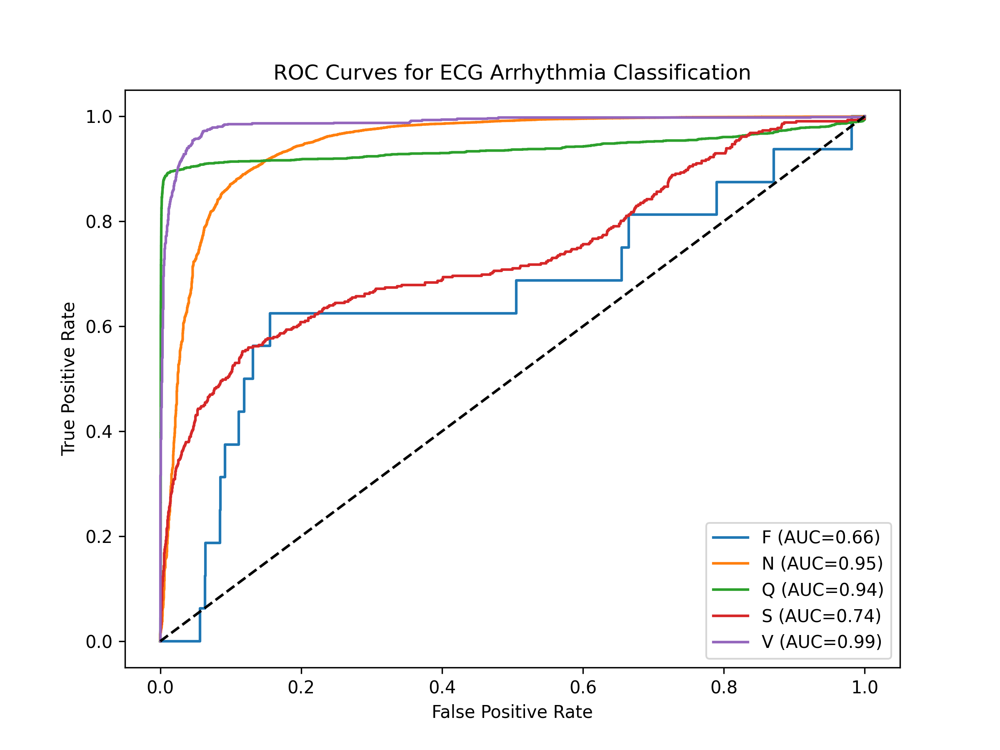
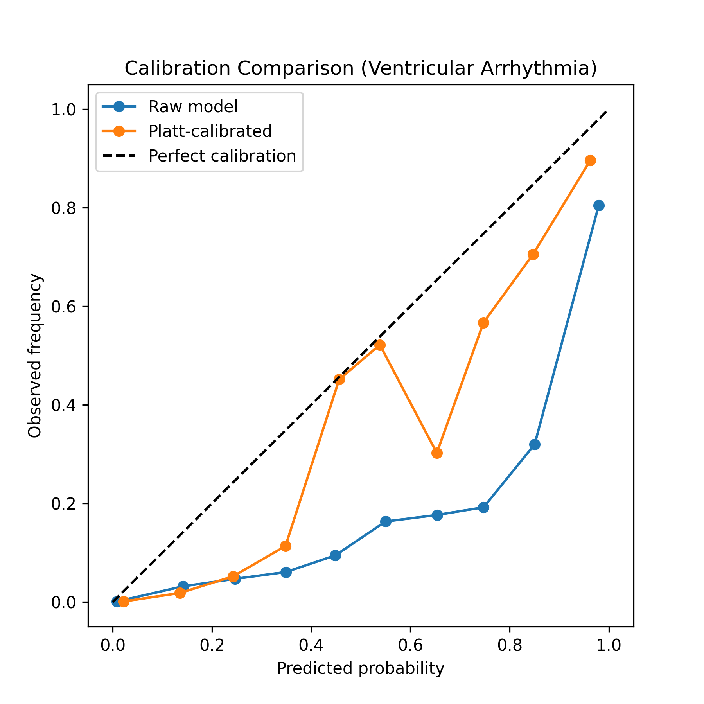
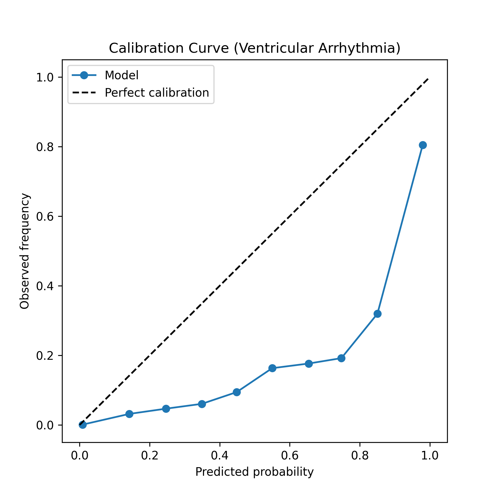
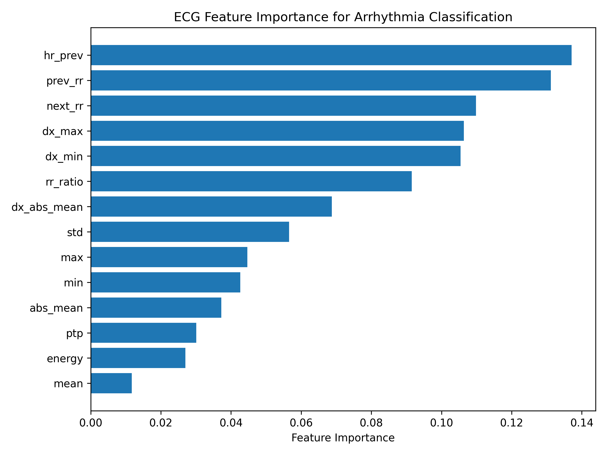

# ECG Arrhythmia Classification and Calibration Study

A reproducible machine learning pipeline for ECG heartbeat classification using the MIT-BIH Arrhythmia Database, with emphasis on proper evaluation practices for medical AI systems including record-wise dataset splitting, probabilistic calibration, and robustness testing.

This project explores cardiovascular signal modelling and demonstrates a research-style workflow for ECG-based arrhythmia detection.

📄 Full research-style report: [Project Report](reports/project_report.pdf)

---

# Overview

Cardiac arrhythmias are often detectable through irregularities in electrocardiogram (ECG) signals. Machine learning methods can assist in identifying these patterns, but rigorous methodology is required to ensure models generalise and produce reliable probability estimates.

This project implements a complete pipeline including:

• ECG signal segmentation  
• Feature extraction from waveform morphology and RR interval timing  
• Record-wise dataset splitting to avoid patient-level data leakage  
• Baseline machine learning models  
• Model evaluation using clinically relevant metrics  
• Probabilistic calibration analysis  
• Feature importance analysis  
• Robustness testing under simulated noise  

The goal is to demonstrate a clinically aware and statistically rigorous workflow for cardiovascular AI research.

---

# Quick Run

```bash
git clone https://github.com/YOUR_USERNAME/ecg-arrhythmia-calibration.git
cd ecg-arrhythmia-calibration

python3 -m venv .venv
source .venv/bin/activate

pip install -r requirements.txt

python -m src.download
python -m src.segment
python -m src.train
python -m src.evaluate
```

---

# Dataset

MIT-BIH Arrhythmia Database (PhysioNet)

The dataset contains **48 annotated ECG recordings** sampled at **360 Hz**.

Each recording contains expert annotations identifying heartbeat types.

Beat labels were mapped to the **AAMI heartbeat classification scheme**:

| Class | Description |
|------|-------------|
| N | Normal beats |
| S | Supraventricular ectopic beats |
| V | Ventricular ectopic beats |
| F | Fusion beats |
| Q | Unknown / paced beats |

Total beats processed in this study:

~109,000 heartbeats.

---

# Feature Engineering

Two groups of physiologically meaningful features were extracted.

## Heartbeat Timing Features

These features capture rhythm irregularity.

• Previous RR interval  
• Next RR interval  
• Heart rate derived from RR interval  
• RR interval ratio between adjacent beats  

RR interval variation is a known indicator of arrhythmias such as ventricular ectopy.

---

## Morphological ECG Features

These features capture waveform shape characteristics.

• Mean amplitude  
• Standard deviation  
• Minimum and maximum amplitude  
• Peak-to-peak amplitude  
• Signal energy  
• Absolute mean amplitude  
• Derivative slope statistics  

These features reflect morphological changes in QRS complexes and waveform dynamics.

---

# Dataset Splitting

To prevent patient-level data leakage, dataset splitting was performed at the record level.

This ensures beats from the same ECG recording never appear in both training and evaluation sets.

| Split | Records |
|------|--------|
| Train | 33 |
| Validation | 5 |
| Test | 10 |

This mirrors evaluation practices used in clinical machine learning research.

---

# Models

Two baseline classifiers were implemented.

## Logistic Regression

• Balanced class weighting  
• Feature standardisation  
• Interpretable baseline model  

## Random Forest

• 300 decision trees  
• Balanced class weighting  
• Non-linear decision boundaries  

These models provide a comparison between linear and ensemble learning approaches.

---

# Model Comparison

A direct comparison was performed between the two baseline models for ventricular arrhythmia detection.

The Random Forest classifier slightly outperformed Logistic Regression:

• Logistic Regression ROC-AUC: **0.982**  
• Random Forest ROC-AUC: **0.986**

This suggests that non-linear feature interactions captured by the Random Forest provide a small performance advantage over the linear baseline model.

### Ventricular Arrhythmia ROC Comparison


# Evaluation Metrics

Model performance was evaluated using:

• Balanced Accuracy  
• Macro ROC-AUC  
• Precision–Recall AUC  
• Confusion matrices  

Balanced accuracy was emphasised due to class imbalance between normal and arrhythmic beats.

---

# Probabilistic Calibration

Reliable probability estimates are critical in clinical prediction systems.

Calibration was evaluated using:

• Brier Score  
• Reliability diagrams (calibration curves)

Results showed that the baseline model tended to overestimate ventricular arrhythmia probability.

Platt scaling was applied using a validation set, improving calibration:

Raw model Brier score: **0.0222**  
Calibrated model Brier score: **0.0179**

---

# Feature Importance

Feature importance analysis revealed that heartbeat timing features were the strongest predictors of arrhythmia classification.

Top predictors include:

• Previous heart rate  
• Previous RR interval  
• Next RR interval  
• Waveform slope statistics  

These findings align with established electrophysiological indicators of rhythm irregularity.

---

# Robustness Analysis

To simulate real-world signal perturbations, Gaussian noise was introduced to ECG-derived features.

Balanced accuracy results:

Clean data: **0.67**  
Noisy data: **0.62**

The modest performance degradation indicates the model retains reasonable stability under moderate signal noise.

---

# Example Results

| Class | ROC-AUC |
|------|---------|
| Ventricular (V) | ~0.99 |
| Normal (N) | ~0.95 |
| Unknown (Q) | ~0.94 |
| Supraventricular (S) | ~0.74 |
| Fusion (F) | ~0.66 |

Ventricular arrhythmias show strong separability, while rarer classes remain more challenging.

---
## Example Figures

### ROC Curves


### Calibration Comparison


### Ventricular Arrhythmia Calibration


### Feature Importance


# Repository Structure

```
ecg-arrhythmia-calibration
│
├── README.md
├── requirements.txt
│
├── data
│   ├── raw
│   ├── processed
│   └── splits
│
├── src
│   ├── download.py
│   ├── segment.py
│   ├── inspect.py
│   ├── split.py
│   ├── split_calib.py
│   ├── train.py
│   ├── evaluate.py
│   ├── calibrate.py
│   ├── noise_test.py
│   └── plots.py
│
├── reports
│   └── figures
│
└── notebooks
```

---

# Running the Full Pipeline

```bash
# DATA PIPELINE
python -m src.download
python -m src.segment
python -m src.inspect

# DATA SPLITTING
python -m src.split
python -m src.split_calib

# MODEL TRAINING
python -m src.train

# MODEL EVALUATION
python -m src.evaluate

# PROBABILITY CALIBRATION
python -m src.calibrate

# ROBUSTNESS TESTING
python -m src.noise_test
```

---

# Technologies

Python  
Scikit-learn  
WFDB  
NumPy  
Pandas  
Matplotlib  

---

# Author

This project was developed as part of a portfolio exploring AI applications in cardiovascular signal analysis and clinical prediction modelling.
